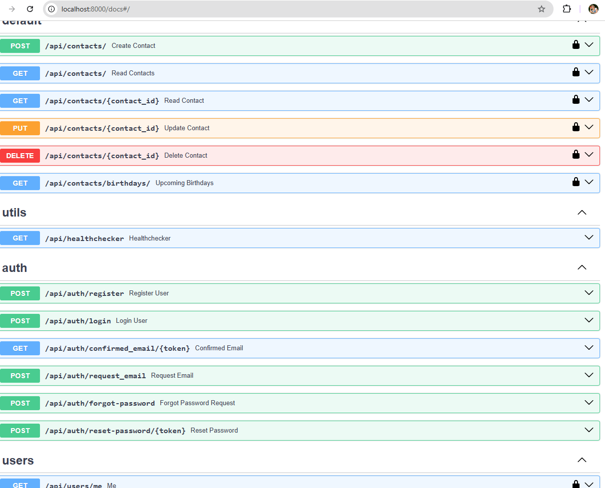
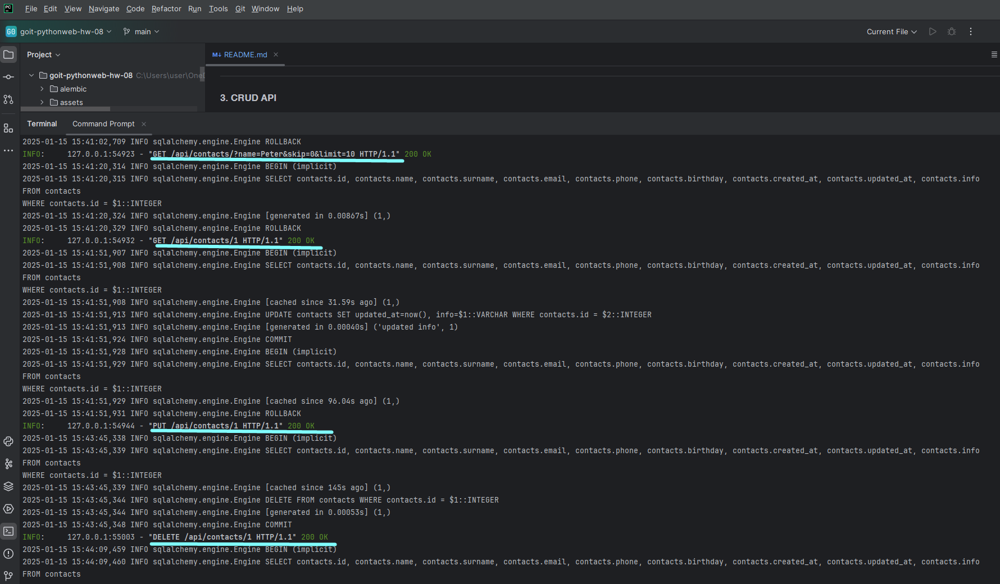
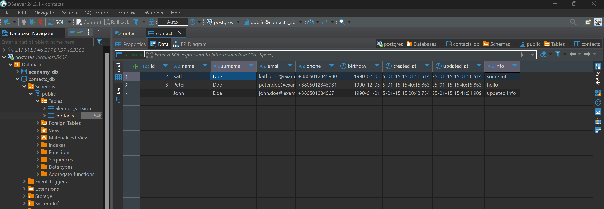

# Topic 8. Homework | FastAPI | Building a REST API | Application Architecture

## Objective

The goal of this homework assignment is to create a REST API for storing and managing contacts. The API should be built using the FastAPI framework and should use SQLAlchemy for database management.

---

## Technical Task Description

### 1. Contacts

To store the contacts in your system, you need to organize a database that will contain all the necessary information.

The information should include:

- First Name  
- Last Name  
- Email Address  
- Phone Number  
- Birthday  
- Additional Information (optional)

---

### 2. API

The API you develop should support basic data operations. Below is the list of actions your API should be able to perform:

- Create a new contact  
- Retrieve a list of all contacts  
- Retrieve a single contact by ID  
- Update an existing contact  
- Delete a contact  

---

### 3. CRUD API

In addition to the basic CRUD functionality, the API should also support the following features:

- Contacts should be searchable by first name, last name, or email address (Query parameters).  
- The API should be able to retrieve a list of contacts with birthdays in the next 7 days.  

---

## General Requirements for Homework Completion

- Use the **FastAPI** framework to create the API.  
- Use the ORM **SQLAlchemy** to interact with the database.  
- PostgreSQL should be used as the database.  
- Support CRUD operations for managing contacts.  
- Support storing the contact's date of birth.  
- Provide **Swagger** documentation for the REST API.  
- Use the **Pydantic** module for data validation.

# TASK RESULTS

