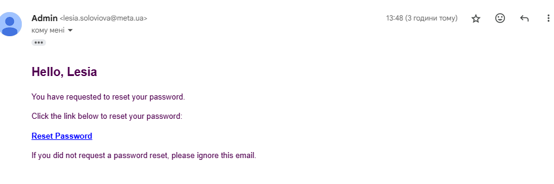
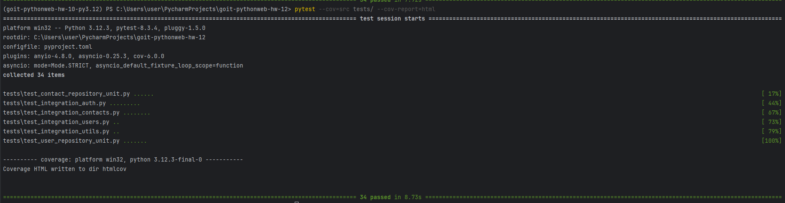

# Topic 12. Homework | FastAPI | Building a REST API | Final Homework Assignment

## Greetings, friends! 🙂 ✋🏼

The FullStack Web Development with Python course is now behind you, and you are on the threshold of your final homework assignment. This task will summarize and reinforce all the knowledge, skills, and abilities you have acquired throughout the course.

In this final homework, you must refine your REST API application from previous assignments.

---

## Technical Description of the Assignment

### 1. Documentation with Sphinx
Use Sphinx to generate documentation for your application. Add docstrings to necessary functions and class methods in the main modules.

### 2. Unit Testing
Cover your application's repository modules with unit tests.

### 3. Integration Testing
Cover your application's routes with integration tests using the pytest framework.

### 4. Test Coverage Above 75%
Ensure that your application is covered with tests by at least 75%. Use the pytest-cov package to monitor coverage.

### 5. Caching Mechanism with Redis
Implement a caching mechanism using Redis. Cache the current user during authentication so that the `get_current_user` function retrieves the user from the cache instead of querying the database every time.

### 6. Password Reset Mechanism
Implement a password reset mechanism for the REST API application.

### 7. User Roles and Access Control
Implement role-based access control for users with roles: `user` and `admin`. Ensure that only administrators can change their default avatar independently.

👉🏻 The last three tasks were not part of previous homework assignments, but these aspects are thoroughly covered in the course materials. Feel free to seek help from a mentor if needed.

---

## General Requirements for the Homework Assignment

👉🏻 The following requirements are mandatory for mentor evaluation. If any requirement is missing, the mentor will return the assignment for revision without grading. If you need clarification 😉 or get stuck on a step, contact the mentor via Slack.

### 1. Code Documentation
All main functions and class methods must have appropriate docstrings for Sphinx documentation generation.

### 2. Testing
- Test modules should be structured according to your application’s organization.
- Use pytest for writing unit and integration tests.
- Ensure at least 75% test coverage of the application code. Use pytest-cov to verify coverage.

### 3. Caching with Redis
- Set up Redis as a caching service for your application.
- Ensure data security and validity when caching user information.

### 4. Password Reset
Implement a secure password reset mechanism with email confirmation or another method.

### 5. Role Management
- Implement a user role system.
- Ensure access control checks for operations restricted to administrators.

### 6. Confidential Data Storage
All confidential data and settings should be stored in a `.env` file. Do not include confidential data in the codebase.

### 7. Containerization
Use Docker Compose to launch all services and databases of your application.

---

# TASK RESULTS

